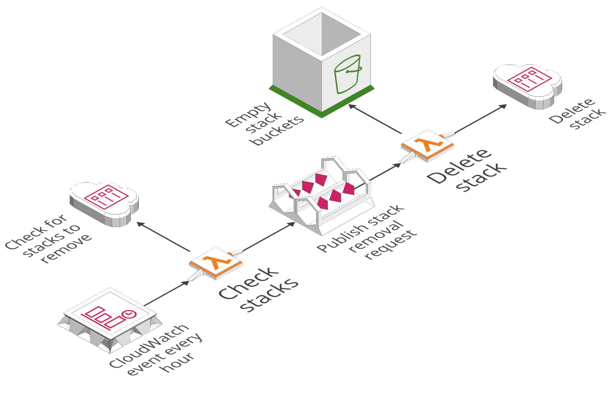

<p align="center">
  
  
</p>

<p align="center">
  <a href="https://circleci.com/gh/manwaring-automation/odin">
    </a>
  <a href="https://codecov.io/gh/manwaring-automation/odin">
    </a>
  <a href="https://app.dependabot.com/accounts/manwaring-automation/repos/81763321">
    </a>
  <a href="https://david-dm.org/manwaring-automation/odin">
    </a>
  <a href="https://david-dm.org/manwaring-automation/odin?type=dev">
    </a>
  <a href="https://github.com/manwaring-automation/odin/blob/master/LICENSE">
    </a>
  
</p>

# Odin

Odin, or Wōtan, is a Norse god who directs the valkyries and is the guardian of Valhalla. Half of those who perish in combat are welcomed by him into his majestic halls where they prepare for the final battle against Fenrir during the events of Ragnarök.

This serverless application periodically checks the status of CloudFormation stacks in the AWS account and region where it is deployed and sends the stale, removable ones to Valhalla by deleting them.

# What it does

Because Odin's removal of stacks is destructive the default action it takes is leaving a stack as-is - Odin will only delete a stack when it's current state matches all of the following three criteria:

1.  **Tagging:** If a stack is _not_ tagged with any of the stages specified as permanent in [odin.yml](odin.yml) then it is _eligible for removal_
1.  **Status:** If a stack's status is _not_ one of those specified as off-limits in [odin.yml](odin.yml) then it is _eligible for removal_
1.  **Age:** If a stack has _not_ been updated within the timeframes specified in [odin.yml](odin.yml) then it is _eligible for removal_

# How to use it

## Custom configuration

To change the frequency with which Odin runs and the settings used to determine whether a stack is eligible for deletion modify the values in [odin.yml](odin.yml) and redeploy the application.

## Serverless Framework

Odin is built with the [Serverless Framework](https://serverless.com/framework/docs/) - see their documentation for more about the tool and how to use it.

## Thundra setup & configuration

Odin uses [Thundra](https://thundra.io/) as a serverless monitoring and logging solution. To package and deploy the application with the Thundra integration you'll need to setup an account and provide a Thundra access token either as an environment variable or in a local `.env` file:

```
THUNDRA_TOKEN=<token>
```

There are instructions for [setting up your Thundra account](https://docs.thundra.io) and [configuring the Thundra serverless plugin](https://github.com/thundra-io/serverless-plugin-thundra).

If you don't want to include the integration you can comment out the Thundra plugin in `serverless.yml`, and optionally comment out the Thundra-specific configurations:

```yml
plugins:
  - serverless-webpack
  - serverless-cloudformation-resource-counter
  - serverless-prune-versions
  # - serverless-plugin-thundra

provider:
  environment:
    # thundra_apiKey: ${opt:thundra, env:THUNDRA_TOKEN}
```

## Local development

Install dependencies:
`npm i`

Run unit test:
`npm test`

Deploy Odin:
`npm run deploy`

Deploy Odin to a specific stage using a named AWS profile:
`npm run deploy -- --stage <stage> --aws-profile <profile>`

# Limitations

Unlike his Norse namesake Odin is unable to practice magic and cannot remove stacks that aren't self-removing.

A common example of this situation is a stack which creates an S3 bucket that is later filled with files. If the stack doesn't contain the custom resources necessary to empty and then delete this bucket any stack delete commands (whether triggered by Odin, manually, or any other means) will end with the stack in an error state. Don't treat your stacks this way - let them enter Valhalla with honor!

To help with this, by default Odin will empty all S3 buckets in a stack prior to calling the delete stack command. You can either disable bucket emptying entirely or specify specific buckets to be emptied in the [odin.yml](odin.yml) config file.

# Architecture overview



# Default Odin configurations

```yml
schedule:
  # This schedule initiates Odin once a day in the early morning (US ET) to clean up ephemeral stages
  daily:
    rate: cron(0 8 ? * * *) # 8 AM UTC / 3 AM ET

  # This schedule initiates Odin every hour to clean up ephemeral stages
  hourly:
    rate: cron(0 */1 ? * * *) # every hour

dynamicRules:
  daily:
    staleAfter: 2 # When running the daily check, delete a stack if its older than 2 hours
  hourly:
    staleAfter: 8 # When running the hourly check, delete a stack if its older than 8 hours

# All of these rules are consistent between the schedules
staticRules:
  # Odin won't delete a stack with the following names (case insensitive, partial matches)
  namesToRetain:
    - ControlTower
    - LumigoIntegrationV2

  # Odin won't delete a stack with the following stages (case insensitive, full matches only)
  stagesToRetain:
    - PROD
    - PRODUCTION
    - QA
    - STAGING
    - DEVELOPMENT
    - DEV
    - AUTO
    - AUTOMATION
    - INFRA
    - INFRASTRUCTURE
    - COMMON

  # Odin will only delete a stack if it's status is one of the following
  deleteableStatuses:
    - CREATE_COMPLETE
    - ROLLBACK_COMPLETE
    - UPDATE_COMPLETE
    - UPDATE_ROLLBACK_COMPLETE

  # A CloudFormation stack won't delete successfully if there are non-empty buckets associated with it.
  # Use this property to indicate whether or not you want Odin to empty all buckets in the stack
  # (default behavior). If you only want Odin to empty specific buckets then set this property to false
  # and update the bucketsToEmpty property below with the logical resource ids of the buckets you want
  # Odin to empty.
  emptyAllBuckets: true

  # Odin will empty buckets with the following CloudFormation logical IDs (if you don't want to empty
  # all buckets)
  bucketsToEmpty:
    - ServerlessDeploymentBucket
    - DocumentBucket
    - S3BucketSite
    - ApiDocumentationBucket
```

Config specifications can be found (and modified) in [odin.yml](odin.yml)

# Sample Lambda payloads

## Check stacks

From a [CloudWatch Schedule event](https://serverless.com/framework/docs/providers/aws/events/schedule/):

```json
{
  "namesToRetain": ["ControlTower", "LumigoIntegrationV2"],
  "stagesToRetain": [
    "PROD",
    "PRODUCTION",
    "QA",
    "DEVELOPMENT",
    "DEV",
    "AUTO",
    "AUTOMATION",
    "INFRA",
    "INFRASTRUCTURE",
    "COMMON"
  ],
  "deleteableStatuses": ["CREATE_COMPLETE", "ROLLBACK_COMPLETE", "UPDATE_COMPLETE", "UPDATE_ROLLBACK_COMPLETE"],
  "emptyAllBuckets": true,
  "bucketsToEmpty": ["ServerlessDeploymentBucket", "DocumentBucket", "S3BucketSite", "ApiDocumentationBucket"],
  "staleAfter": 2
}
```

## Delete stack

Payload pulled from an [SNS event](https://serverless.com/framework/docs/providers/aws/events/sns/):

```json
{
  "stackName": "stack-to-delete",
  "config": {
    "namesToRetain": ["ControlTower", "LumigoIntegrationV2"],
    "stagesToRetain": [
      "PROD",
      "PRODUCTION",
      "QA",
      "DEVELOPMENT",
      "DEV",
      "AUTO",
      "AUTOMATION",
      "INFRA",
      "INFRASTRUCTURE",
      "COMMON"
    ],
    "deleteableStatuses": ["CREATE_COMPLETE", "ROLLBACK_COMPLETE", "UPDATE_COMPLETE", "UPDATE_ROLLBACK_COMPLETE"],
    "emptyAllBuckets": true,
    "bucketsToEmpty": ["ServerlessDeploymentBucket", "DocumentBucket", "S3BucketSite", "ApiDocumentationBucket"],
    "staleAfter": 2
  }
}
```

# Project stats

Generated using `npm run project-stats`:

```bash
-------------------------------------------------------------------------------
Language                     files          blank        comment           code
-------------------------------------------------------------------------------
TypeScript                      19             67              5            563
YAML                             5             29             26            237
Markdown                         1             59              0            206
JSON                             2              0              0             79
JavaScript                       4              5              1             69
-------------------------------------------------------------------------------
SUM:                            31            160             32           1154
-------------------------------------------------------------------------------
```

# Odin image source

Murray, Alexander (1874). Manual of Mythology : Greek and Roman, Norse, and Old German, Hindoo and Egyptian Mythology. London, Asher and Co. This illustration is from plate XXXV. Digitized version of the book by the Internet Archive, https://archive.org/details/manualofmytholog00murruoft Published earlier in Reusch, Rudolf Friedrich. 1865. Die nordischen Göttersagen.
